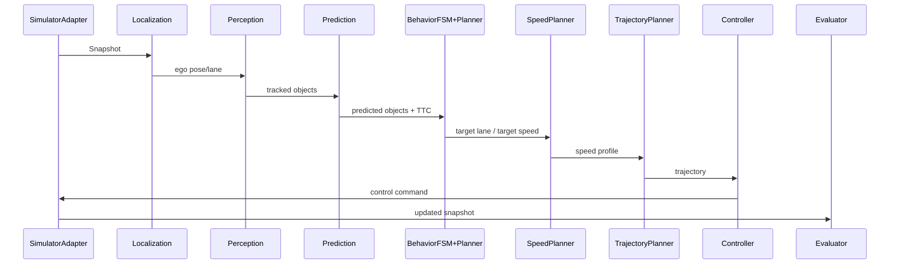

# Runtime Sequence v3

```mermaid
sequenceDiagram
    participant Sim as SimulatorAdapter
    participant Loc as Localization
    participant Per as Perception
    participant Pred as Prediction
    participant Beh as BehaviorFSM+Planner
    participant Spd as SpeedPlanner
    participant Traj as TrajectoryPlanner
    participant Ctl as Controller
    participant Eval as Evaluator

    Sim->>Loc: Snapshot
    Loc->>Per: ego pose/lane
    Per->>Pred: tracked objects
    Pred->>Beh: predicted objects + TTC
    Beh->>Spd: target lane / target speed
    Spd->>Traj: speed profile
    Traj->>Ctl: trajectory
    Ctl->>Sim: control command
    Sim->>Eval: updated snapshot
```
